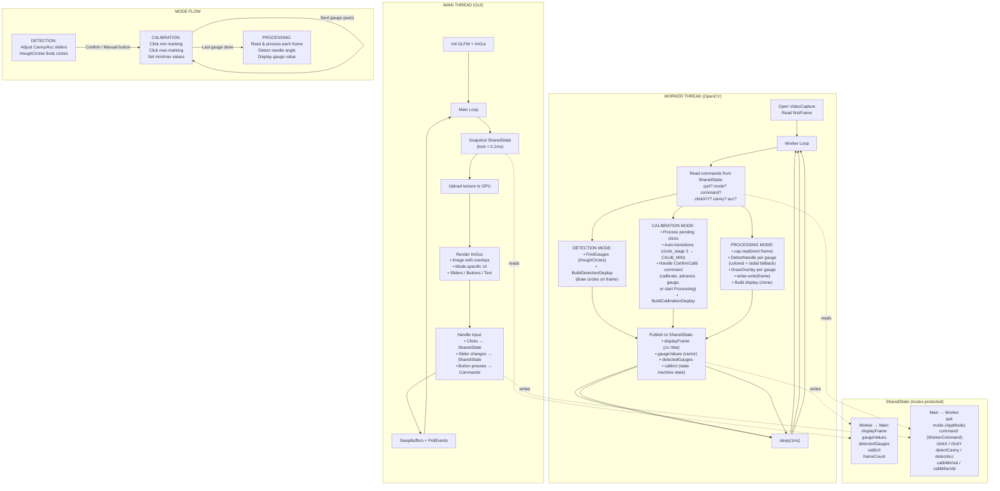

# Gauge Reader — App Workflow



---

## Thread Timeline — How frames flow

```
Worker:  [read N]→[process N]→[publish]→[read N+1]→[process N+1]→[publish]→...
             ↑                            ↑
         frame N                      frame N+1
             ↓                            ↓
Main:        [snapshot N]→[render N]→[snapshot N+1]→[render N+1]→...
```

Worker and Main run in **parallel**. The main thread always shows the latest **completed** frame and never waits for processing.

---

## Key: What runs where

| Operation | Thread | Cost |
|---|---|---|
| `FindGauges` (HoughCircles) | Worker | High |
| `DetectNeedle` (HSV + contours / radial scan) | Worker | High |
| `cap.read` (video I/O) | Worker | Medium |
| `cv::circle`, `cv::putText` (overlays) | Worker | Low |
| `cv::cvtColor` + `glTexImage2D` | Main | Low |
| `ImGui::Render`, `glfwSwapBuffers` | Main | Low |
| Click handling, slider input | Main | Negligible |

The **main thread never blocks** on any high/medium cost operation.
