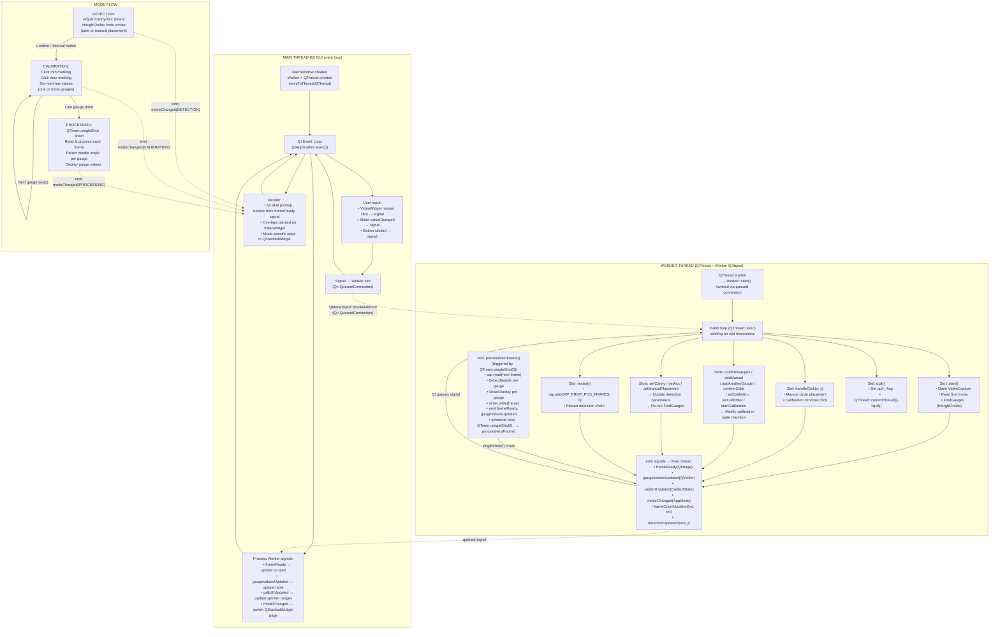

# Gauge Reader — App Workflow



---

## Thread Timeline — How frames flow

```
Worker:  [read N]→[process N]→[emit frameReady(N)]→[next singleShot(0)]→[read N+1]→...
              ↑                          │
          frame N                    Qt queues the signal
              ↓                          ↓
Main:        ...  [processSignal]→[render N]→[next event]→...[process N+1]→[render N+1]→...
```

Worker and Main run in **parallel**. Frames are delivered to the GUI via queued signals — the GUI always shows the latest **completed** frame and never waits for processing.

---

## Key: What runs where

| Operation | Thread | Cost |
|---|---|---|
| `FindGauges` (HoughCircles) | Worker | High |
| `DetectNeedle` (HSV + contours / radial scan) | Worker | High |
| `cap.read` (video I/O) | Worker | Medium |
| `cv::circle`, `cv::putText` (overlays) | Worker | Low |
| `QImage` conversion from `cv::Mat` | Worker | Low |
| `QPixmap::fromImage` + `QLabel::setPixmap` | Main | Low |
| `QSlider`, `QSpinBox`, button event handling | Main | Negligible |
| `QStackedWidget::setCurrentIndex` | Main | Negligible |

The **main thread never blocks** on any high/medium cost operation.

---

## Communication: No shared state

All thread-to-thread communication uses **queued Qt signals/slots**:

| Direction | Mechanism | Example |
|---|---|---|
| Main → Worker | Slot invocation via `QMetaObject::invokeMethod` or signal–slot connection | `invokeMethod(worker_, "setCanny", Qt::QueuedConnection, Q_ARG(int, value))` |
| Worker → Main | Signal emission (auto-queued cross-thread) | `emit frameReady(image)` → Main thread's `onFrameReady` slot |

No mutexes, no shared memory, no polling.

## Mode transitions

Mode changes are signalled from the Worker to Main via `modeChanged(AppMode)`. The Main thread switches the `QStackedWidget` page in response, providing immediate visual feedback. The Worker processes commands asynchronously after the UI has already updated.
